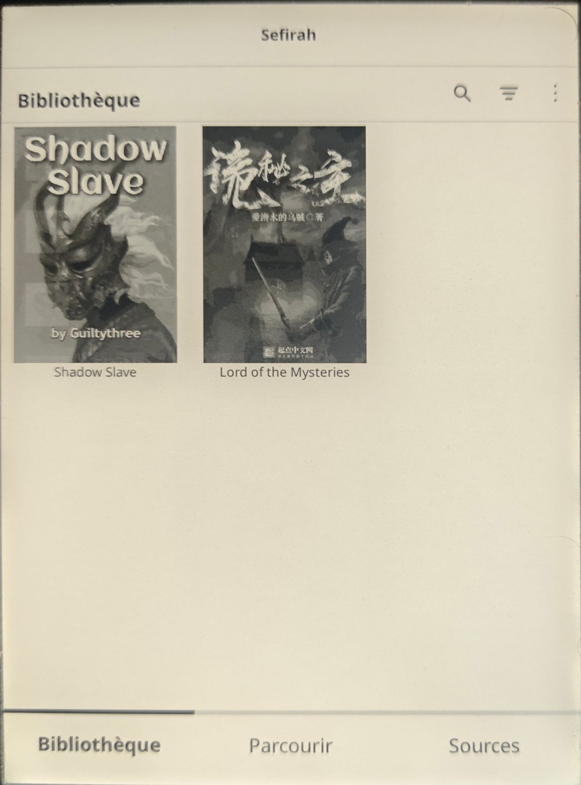
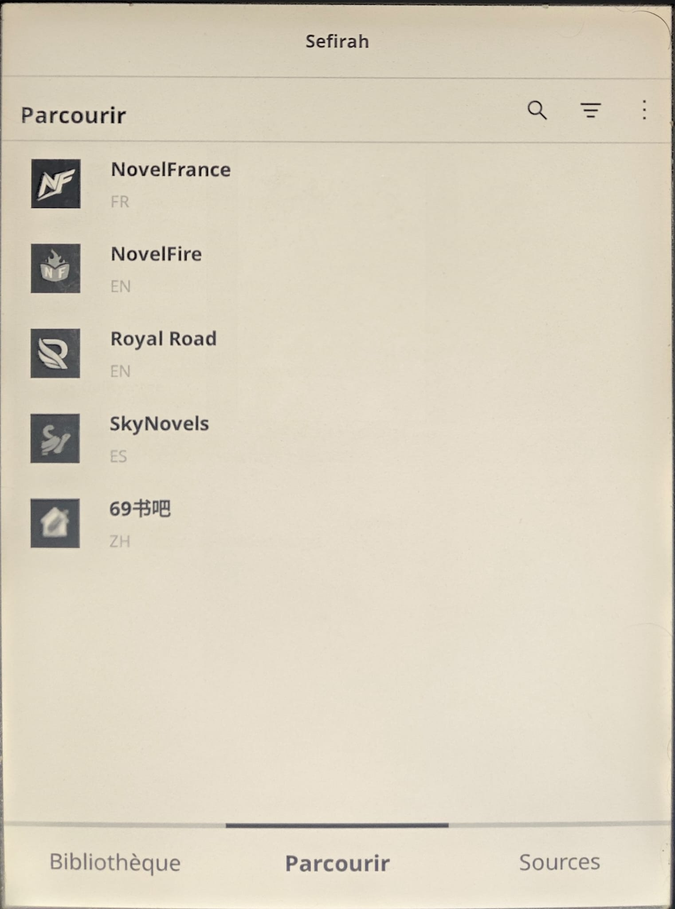
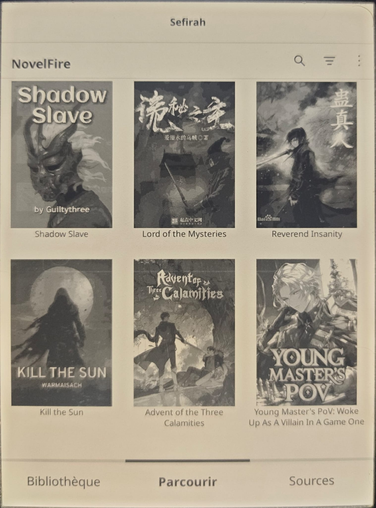
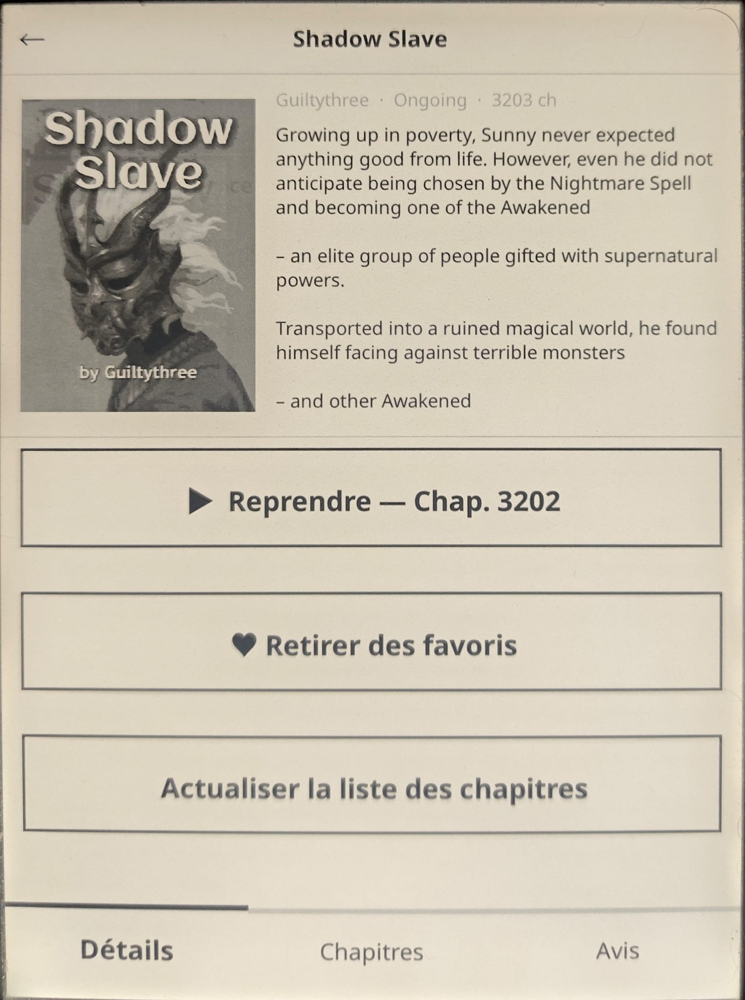
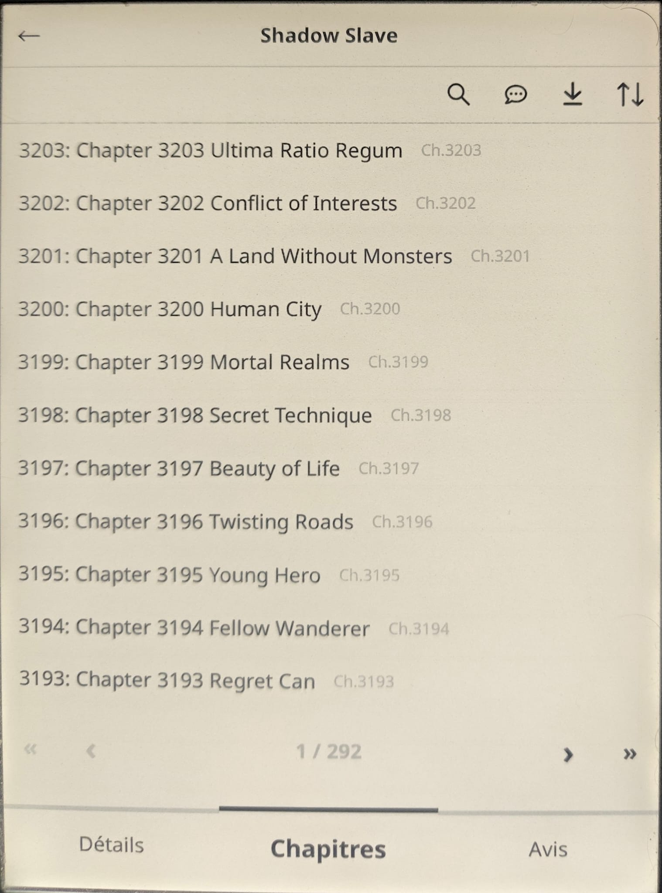
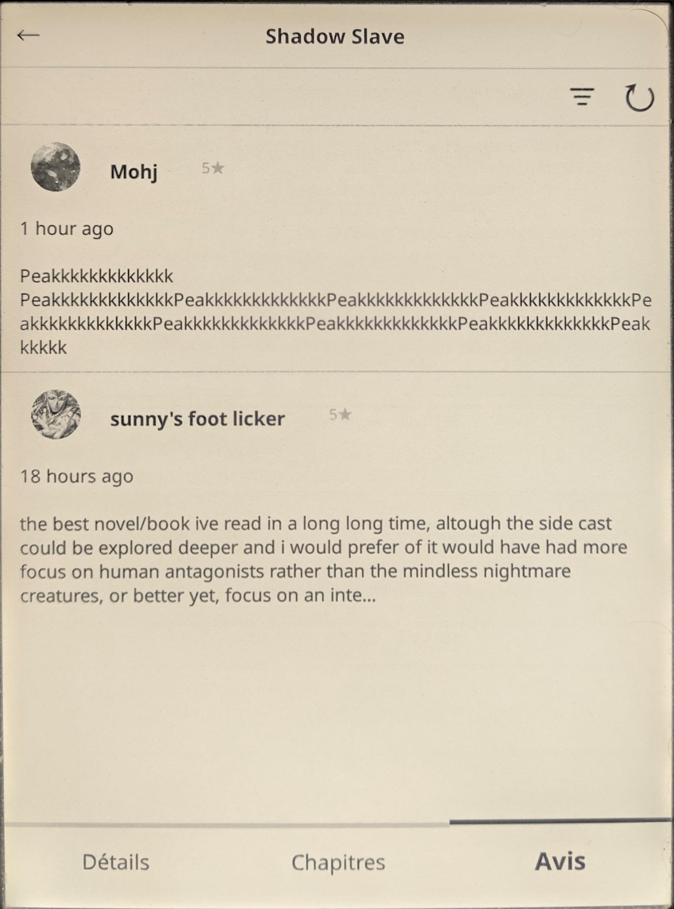
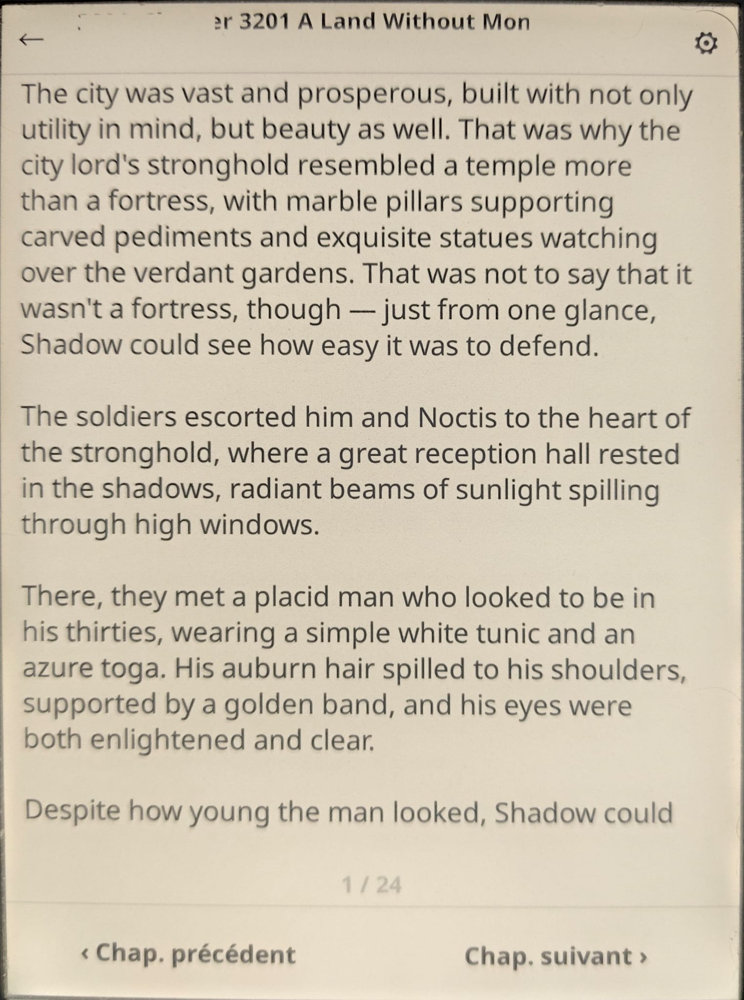
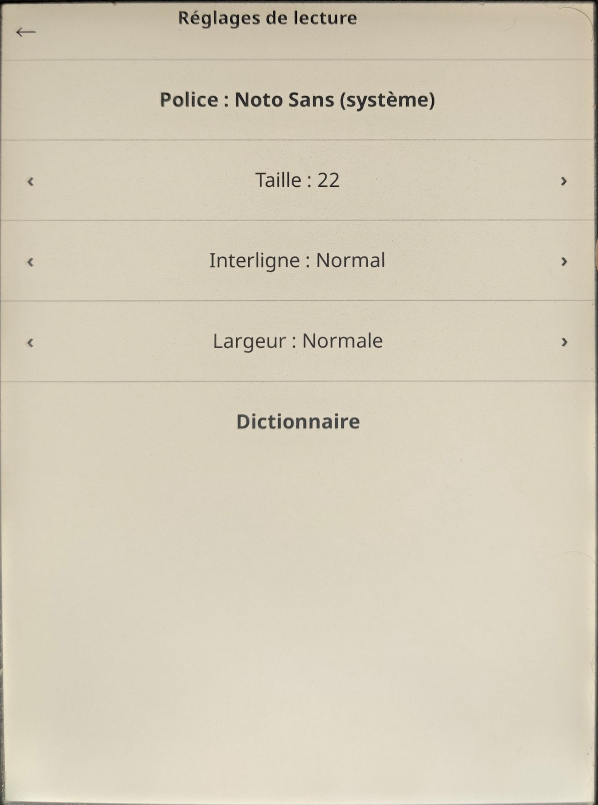
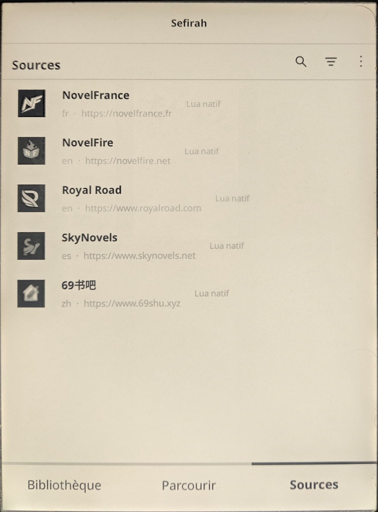

# Sefirah

A web novel library for [KOReader](https://koreader.rocks/). Browse, follow and read your favorite stories, and export them as EPUB to read offline.

> **Sefirah is a fork of [Mythos](https://github.com/unitreign/Mythos) by unitreign**, licensed under GPL-3.0. Modified by thefoolwholovestheworld.

## Screenshots

*(Interface shown in French. It follows KOReader's language.)*

<table>
  <tr>
    <td align="center"> Library</td>
    <td align="center"> Browse: sources</td>
    <td align="center"> Browse: NovelFire</td>
  </tr>
  <tr>
    <td align="center"> Novel details</td>
    <td align="center"> Chapters</td>
    <td align="center"> Reader reviews</td>
  </tr>
  <tr>
    <td align="center"> Reader</td>
    <td align="center"> Reading settings</td>
    <td align="center"> Sources</td>
  </tr>
</table>

## Features

- **Library** of followed novels, with search and sorting (title, new chapters, recently added, recently read).
- **Browse** several sources, with a language filter and a global search across all sources.
- **Novel details**: cover, description, resume reading, favorites.
- **Chapters**: search, jump to a chapter, sort, download a range or everything for offline reading.
- **Reviews and comments**: reader reviews, plus chapter and paragraph comments.
- **Reader** with font, size, line spacing and text width settings, and KOReader's native dictionary.
- **EPUB export**: everything in one file, one EPUB per chapter, grouped volumes, or a chapter range.
- **Fast loading**: covers are downloaded in parallel and cached on disk.
- **Multilingual interface**: follows KOReader's language (French and English).

## Sources

| Source | Language |
|---|---|
| AO3 | Multi |
| LightNovelVF | French |
| NovelFrance | French |
| NovelFire | English |
| Royal Road | English |
| Scribble Hub | English |
| SkyNovels | Spanish |
| 69书吧 (69shu) | Chinese |

## Installation

1. Download `sefirah.zip`.
2. Extract it so that the `sefirah.koplugin` folder ends up in KOReader's `plugins` directory.
3. Restart KOReader, then open **Sefirah** from the Tools menu.

## Credits and license

Sefirah is based on [Mythos](https://github.com/unitreign/Mythos) by unitreign. Distributed under the **GPL-3.0** license, like the original project.
